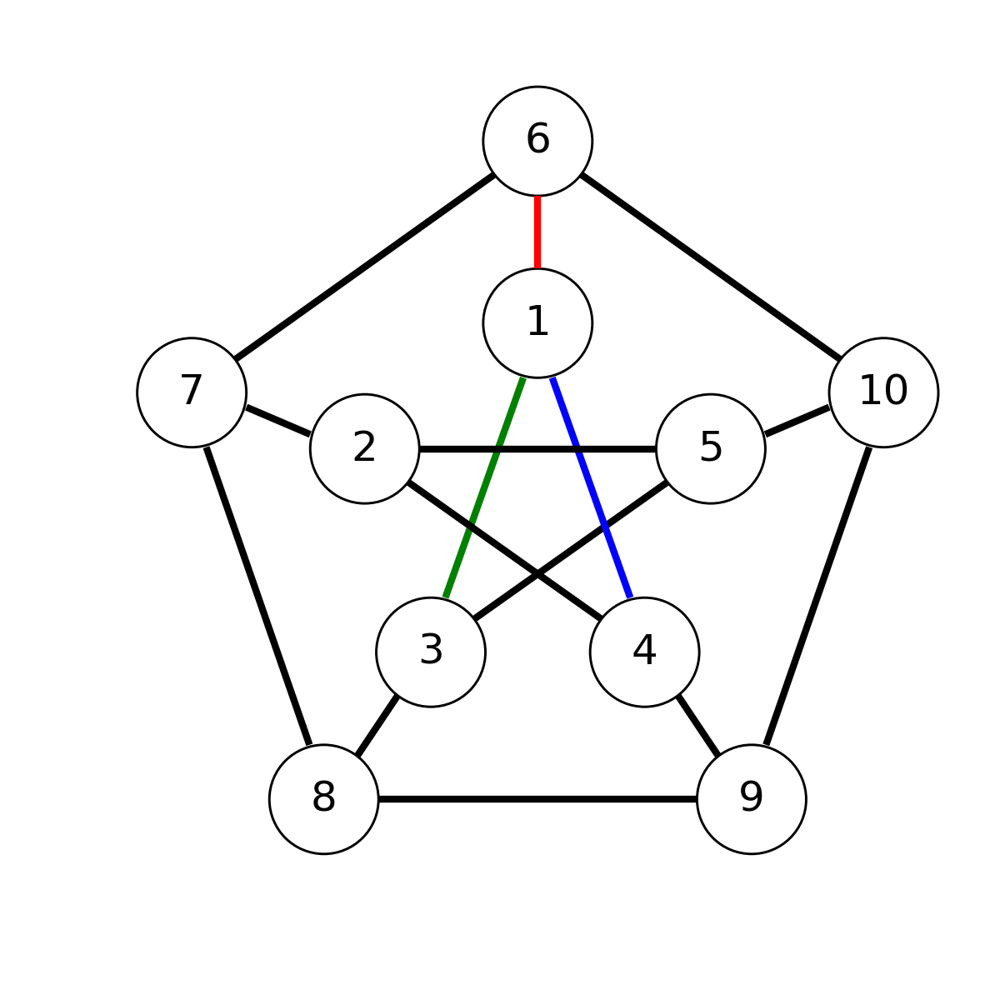
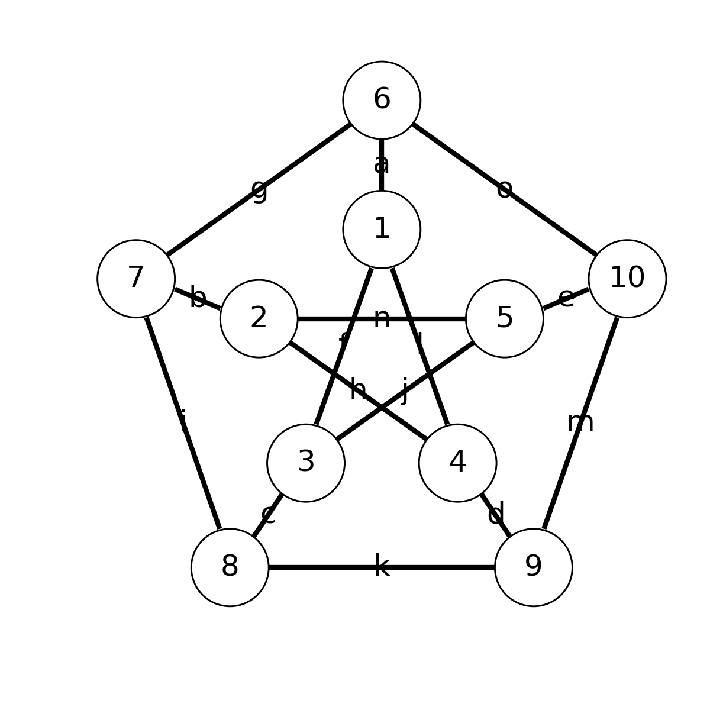

# An Introduction to differentiable tensors

Slides and notebooks for [集智(ji zhi) club](www.swarma.org)

## Table of Contents

* [3-coloring couting problem solved by a tensor network](notebooks/3-coloring-couting.ipynb)
* [Graph embeding problem solved by differential programming](notebooks/graph_embeding.ipynb)
* [Quantum circuit ABC](notebooks/qc-abc.ipynb)
* [Mapping a tensor network to a quantum circuit](notebooks/qc_tensor_mapping.ipynb)
* [Solving the ground state problem with differential programming and variational quantum circuit](notebooks/variational_quantum_circuit.ipynb)

## Blog: 涂色问题与张量网络

### 学者介绍

刘金国

中国科学院物理研究所博士后

现从事量子计算与机器学习的交叉领域

### 背景介绍

张量网络是物理学中重要的工具，它可以用来研究量子态，量子相变。这个工具具有较强的可解释性，性质简洁，逐渐被更多的领域所喜爱，包括数学研究中的TensorTrain，大数据中的数据压缩，社会科学模型[引文 4]，机器学习的监督学习与无监督学习，都和张量网络息息相关。而今天我们要探讨的一类问题是组合优化问题，与上面的应用场景不同的是，这里用张量网络来数数，涉及的数域也只有整数。首先会介绍如何把组合优化中的数数问题转换为张量网络的收缩，其次讲述自动微分的张量网络对于数数问题有什么启发。

### 正文

图论中有个重要的问题叫做三涂色（3-coloring）问题，问的是给定一个图，由顶角V和连边E构成，给图的每个边E上色，可以是RGB（红绿蓝）三色中的一个。问有一共有多少种方式，使得每个顶角相连的三条边的颜色互不相同。作为例子，考虑下图，它的每个顶角的度都是三，即每个顶角有三条边与之相连



这里给1号顶角的连边给了一种可能的着色，而剩余的连边待定。这个图也叫Petersen图，是图论中一个常见的图，它一共有10个顶角和15条边。因此遍历所有连边的涂色是可能的，它的计算复杂度仅为$3^{15}\approx 1.4\times10^6$，我们不妨用穷举法来解答。穷举过程中需要用到15重循环，循环的变量可以用$a-o$来命名，如下图所示

下面展示用于求解的[Julia](https://julialang.org/)代码，打开julia的REPL粘贴即可执行

```julia
"""return 1 if i,j,k are not equal to each other."""
satisfied(i, j, k) = i!=j && j!=k && k!=i ? 1 : 0

"""
count the number of possible 3-coloring for a Petersen Graph.
The naive loop version.
"""
function petersen_coloring()
    res = 0
    for a=1:3, b=1:3, c=1:3, d=1:3, e=1:3, f=1:3, g=1:3,
        h=1:3, i=1:3, j=1:3, k=1:3, l=1:3, m=1:3, n=1:3, o=1:3
        res += satisfied(a,f,l)*satisfied(b,h,n)*satisfied(c,j,f)*
        satisfied(d,l,h)*satisfied(e,n,j)*satisfied(a,g,o)*satisfied(b,i,g)*
        satisfied(c,k,i)*satisfied(d,m,k)*satisfied(e,o,m)
    end
    res
end

petersen_coloring()
```

这个15重循环最后输出的结果为$0$，意味着**在Petersen图上，一个满足要求的三色涂色都没有**。上面的求解中，我们用到的函数`satisfied(i,j,k)`代表了一个节点的填色是否满足要求，这里用1,2,3代表了RGB三种颜色，循环体中，只有所有节点的限定条件都被满足，这个填色方案才贡献1。注意到这里函数的输入维度是有限的，它可以用一个三阶张量`s[i,j,k] := satisfied(i,j,k)`来表达，上图很自然的映射到了**张量网络**的指标求和问题
$$
y = \sum\limits_{a,b\ldots o=1}^3 s_{afl}s_{bhn}\ldots s_{eom}
$$
省去前面大大的求和记号，就可以得到爱因斯坦记号表示
$$
y = s_{afl}s_{bhn}\ldots s_{eom}
$$
爱因斯坦记号意思是，将上图张量的角标中，成对指标的维度收缩（即求和），而同指标求和也被称为张量收缩，在在物理领域是非常常见的操作。爱因斯坦自己曾调侃道这是数学史上的一项重要发现

> "I have made a great discovery in mathematics; I have suppressed the summation sign every time that the summation must be made over an index which occurs twice..."


过了将近一个世纪，程序员们（可能是`numpy`的工程师）把这套记号发展得更加强大，除了同指标收缩，它还可以表达`trace`, `sum`等常见操作，比如

```julia
"ii->"
```

代表了一个二阶输入张量，用`A[i,i]`进行指标索引，输出为0阶张量 (标量)`C[]`。对指标`i`进行循环，将输入的张量对应位置元素累加到输出上，即代表`trace`。

```julia
"ij,jk->ik"
```

代表了两个二阶输入张量，分别用`A[i,j]`和`B[j,k]`进行指标索引，输出为二阶张量`C[i,k]`。对所有出现的指标`ijk`进行循环，将输入的张量对应位置元素的**乘积**累加到输出的对应元素上。

```julia
"ij,ik,il->jkl" : "jkl,ik,il->ij", "ij,jkl,il->ik", "ij,ik,jkl->il"
```

而这个代表了一种星形的收缩（star-contraction）。

所以当`einsum`不再省略输出指标，我们可以定义更加丰富的运算，这些新引入的规范拓展了**张量网络**，这类记号一般认为与机器学习概率图中的**factor graph** 等价，也在某些文献中被称为**拓展-张量网络**[引文 1]。

3-涂色问题中定义的张量网络的拓扑与原图同构，原图的顶角映射成为了一个张量，而边映射成为张量的一个收缩维度。于是我们可以用如下代码求解这个问题

```julia
using OMEinsum
s = map(x->Int(length(unique(x.I)) == 3), CartesianIndices((3,3,3)))
ein"afl,bhn,cjf,dlh,enj,ago,big,cki,dmk,eom->"(fill(s, 10)...)
```

这里我们用了短短两行代码实现了上面的15重循环。上面用到了爱因斯坦求和记号的库叫做[`OMEinsum`](https://github.com/under-Peter/OMEinsum.jl)，是19年的Google Summer of Code项目，作者Andreas Peter有个不错的[Blog](https://nextjournal.com/under-Peter/julia-summer-of-einsum)讲关于它的实现，安装需要在Julia的Pkg模式（在REPL输入`]`进入）输入`pkg> add OMEinsum#master`。

一个类似但更加重要的问题叫做3-SAT问题。假设我们有一堆Bool型变量$\{x_1, x_2, \ldots, x_n\}$，我们可以用这些变量作Bool代数构造一些Clause，比如$C_1 := x_1 \land x_2 \lor x_3$。
Clause $C_1$ 的真值表是

| $x_1, x_2, x_3$ | $C_1$ |
| --------------- | ----- |
| 000             | 0     |
| 100             | 0     |
| 010             | 0     |
| 110             | 1     |
| 001             | 1     |
| 101             | 1     |
| 011             | 1     |
| 111             | 1     |

3-SAT问题的指的是，对于涉及3个变量的多个Clause，有多少个同时（对Clauses求$\and$）为真的case。它的判定版本，即判断一个3-SAT问题有没有解被证明是NP-complete困难的，也就是一般人们认为不存在经典的算法能在多项式时间之内把它求解。而计算出3-SAT解的个数是相对更加困难的问题。考虑下面一个简单的例子：

$(\lnot x_1 \lor x_2 \lor x_3)\land(\lnot x_2\lor\lnot x_3\lor x_4)\land(x_3\lor x_1\lor x_4)$

```julia
indices = CartesianIndices((2,2,2))
C1 = map(x-> Int(x[1]==1 || x[2]==2 || x[3]==2), indices)
C2 = map(x-> Int(x[1]==1 || x[2]==1 || x[3]==2), indices)
C3 = map(x-> Int(x[1]==2 || x[2]==2 || x[3]==2), indices)
ein"abc,bcd,cad->"(C1, C2, C3)
```

最后输出有10种，它们分别是“0011, 0100, 0101, 1000, 1010, 1011, 1100, 1101, 1110, 1111”。

到此为止，我们了解了**张量网络**就是由张量收缩定义出的网络结构，它对图着色和SAT问题等几种counting问题中有着更加简洁的表达。那么优点是什么？

考虑到张量的收缩中对指标的求和并不一定是同时进行，比如我们可以先收缩$（V_1,V_3）$节点，收缩过程设计5个指标，包括1个哑指标（成对消去的指标）,和4个保留的指标，计算复杂度为$O(\chi^5)$ (这里$\chi = 3$)，我们将结果记为$V_{1,3}$。接着收缩$V_{1,3}$与$V_4$，复杂度为$\chi^6$, 接着一次收缩掉$2, 5, 6, 7, 8, 9, 10$。整个收缩过程最大复杂度为$\chi^7$。

当边上定义的变量数$\chi$足够大，那么收缩复杂度$\chi^7$和$\chi^{15}$相差是巨大的。不幸的是，确定最优收缩顺序本身是NP-complete困难的，虽然有一些算法（比如图论的treewidth以及一些张量领域的算法）可以求解上百个节点的张量网络，但是更大就不再现实。这些算法为量子计算的模拟[引文 3]，社交网络的研究[引文 4]提供了便利。

### 自动微分

自动微分目的是对我们定义的实损失函数$\mathcal{L}$, 计算微分$\frac{\partial \mathcal{L}}{\partial x}$，其中$x$为输入参数。一种常见的自动微分手段是向后传播，即已知损失函数对输出的导数$\frac{\partial \mathcal{L}}{\partial y}$，可以通过链式法则$\frac{\partial \mathcal{L}}{\partial x} = \frac{\partial \mathcal{L}}{\partial y}\frac{\partial y}{\partial x}$计算得到对输入的导数。

一个有趣的观察是，爱因斯坦记号的自动微分有着非常优雅的形式

```julia
# trace
"ii->" : "->ii"
# matrix multiplication
"ij,jk->ik" : "ik,jk->ij", "ij,ik->jk"
# star contraction
"ij,ik,il->jkl" : "jkl,ik,il->ij", "ij,jkl,il->ik", "ij,ik,jkl->il"
```

这里，`:`右侧是自动微分向后传播的公式，对不同输入参数的微分用`,`隔开。

比如`"ij,jk->ik" : "ik,jk->ij", "ij,ik->jk"`意味着

```julia
# forward pass
y = ein"ij,jk->ik"(A, B)
# backward pass
dLdA = ein"ik,jk->ij"(dLdy, B)
dLdB = ein"ij,ik->jk"(A, dLdA)
```

* 注： 这里只考虑了实数，复数版本见下面的blog，需要考虑Wirtingers代数。

从这些例子，大家是否观察到一些特点呢？证明就不放到这里，可以移步到这个[blog](https://giggleliu.github.io/2019/04/02/einsumbp.html)。


自动微分是机器学习给张量网络带来的珍贵礼物，它在物理学中张量网络的自动微分可以计算热力学量，可以变分优化量子力学基态 [引文 2]。但是这里的例子都是离散的输入的counting问题，自动微分能给我们带来什么呢？考虑这么一个问题，因为我们发现Petersen图没有满足要求的涂色方案，老板们非常生气，告诉我们可以放宽其中1号节点的条件，然后我们应该怎么放宽这些条件呢？

答案是，怎么放宽都不行！

```julia
using Zygote: gradient
gradient(x->ein"afl,bhn,cjf,dlh,enj,ago,big,cki,dmk,eom->"(x,s,s,s,s,s,s,s,s,s)[], s)
```

梯度结果给出全0的矩阵，所以光松弛一个节点的要求是不够的。如果结果是非零，就对应了松弛了条件能够增加多少个满足条件的涂色方案。有兴趣的同学可以思考下为何会有这种对应关系？（提示：可以从上文$y$的表达式出发）

## 引文列表

> 1. Glasser, Ivan, Nicola Pancotti, and J. Ignacio Cirac. "Supervised learning with generalized tensor networks." arXiv:1806.05964
> 2. Hai-Jun Liao, Jin-Guo Liu, Lei Wang, Tao Xiang. "Differentiable Programming Tensor Networks" arXiv:1903.09650
> 3. Markov, I. L., & Shi, Y. (n.d.). Simulating quantum computation by contracting tensor networks, 1–21.
> 4. Yang, Zi, et al. "Social community analysis via a factor graph model." IEEE Intelligent Systems 3 (2010): 58-65.