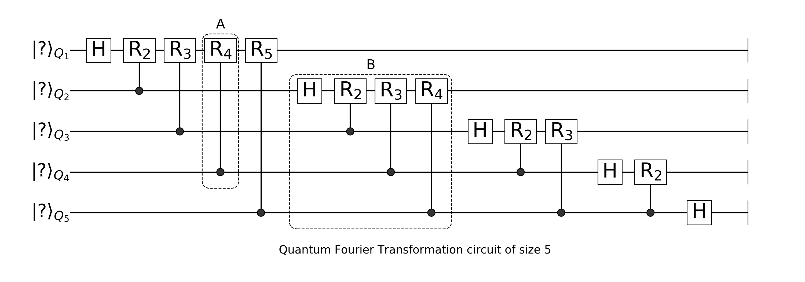
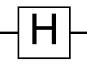
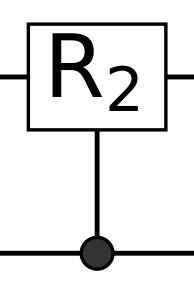
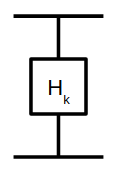
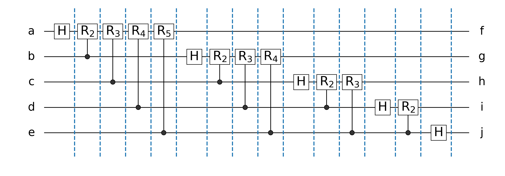

# Mapping a QFT circuit to a TN




```julia
using TensorOperations, Test, OMEinsum
```

## Hadamard Gate



```julia
using Yao # the quantum circuit simulator in Julia
mat(H)
```


    2×2 Array{Complex{Float64},2}:
     0.707107+0.0im   0.707107+0.0im
     0.707107+0.0im  -0.707107+0.0im


## Control-Phase Gate


control-Tensor (bottom): $\delta_{ijk}$

Phase-Tensor (bottom): ${\rm R_k}_{ljm} = \begin{cases}\delta_{lm} & j=0,\\ \rm{diag}(1, e^{i\frac{2\pi}{2^{\rm k}}}) & j=1.\end{cases}$


```julia
CRk(i::Int, j::Int, k::Int) = control([i, ], j=>shift(2π/(1<<k)))
mat(CRk(2,1,2)(2))
```


    4×4 LinearAlgebra.Diagonal{Complex{Float64},Array{Complex{Float64},1}}:
     1.0+0.0im      ⋅          ⋅                  ⋅    
         ⋅      1.0+0.0im      ⋅                  ⋅    
         ⋅          ⋅      1.0+0.0im              ⋅    
         ⋅          ⋅          ⋅      6.12323e-17+1.0im


```julia
function Rk(k)
    y = zeros(ComplexF64, 2,2,2)
    y[:,1,:] = δ(2,2)
    y[:,2,:] = [1 0; 0 exp(2im*π/2^k)]
    y
end

function δ(dims...)
    y = zeros(dims)
    for i=1:min(dims...)
        y[fill(i, length(dims))...] = 1
    end
    y
end

@test reshape(ein"abc,dbe->adce"(δ(2,2,2), Rk(2)), 4, 4) ≈ mat(CRk(2,1,2)(2))
```


    Test Passed


or equivalently


with
${\rm H_k} = \left(\begin{array}(1 & 1 \\ 1 & e^{i\frac{2\pi}{2^{\rm k}}}\end{array}\right)$

# Obtaining the result directly


```julia
CRot(n::Int, i::Int) = chain(n, i==j ? kron(i=>H) : CRk(j, i, j-i+1) for j = i:n)
QFTCircuit(n::Int) = chain(n, CRot(n, i) for i = 1:n)

qft = QFTCircuit(5)
```


    nqubits: 5
    chain
    ├─ chain
    │  ├─ kron
    │  │  └─ 1=>H gate
    │  ├─ control(2)
    │  │  └─ (1,) shift(1.5707963267948966)
    │  ├─ control(3)
    │  │  └─ (1,) shift(0.7853981633974483)
    │  ├─ control(4)
    │  │  └─ (1,) shift(0.39269908169872414)
    │  └─ control(5)
    │     └─ (1,) shift(0.19634954084936207)
    ├─ chain
    │  ├─ kron
    │  │  └─ 2=>H gate
    │  ├─ control(3)
    │  │  └─ (2,) shift(1.5707963267948966)
    │  ├─ control(4)
    │  │  └─ (2,) shift(0.7853981633974483)
    │  └─ control(5)
    │     └─ (2,) shift(0.39269908169872414)
    ├─ chain
    │  ├─ kron
    │  │  └─ 3=>H gate
    │  ├─ control(4)
    │  │  └─ (3,) shift(1.5707963267948966)
    │  └─ control(5)
    │     └─ (3,) shift(0.7853981633974483)
    ├─ chain
    │  ├─ kron
    │  │  └─ 4=>H gate
    │  └─ control(5)
    │     └─ (4,) shift(1.5707963267948966)
    └─ chain
       └─ kron
          └─ 5=>H gate


```julia
# get the result using a vector based quantum simulator
reg = rand_state(5);
res = copy(reg) |> qft
ψ = dropdims(reg |> hypercubic, dims=6)
```


    2×2×2×2×2 Array{Complex{Float64},5}:
    [:, :, 1, 1, 1] =
     0.0224271-0.093019im    0.233175+0.0592647im 
     -0.095633-0.00294187im   0.12047-0.00984994im
    
    [:, :, 2, 1, 1] =
     0.0380472+0.141338im   -0.087897+0.0364162im
     -0.124344+0.119878im  -0.0926874-0.0906802im
    
    [:, :, 1, 2, 1] =
      -0.14541-0.288891im   -0.0310531-0.0207117im
     0.0463507-0.0776741im   -0.180881-0.150681im 
    
    [:, :, 2, 2, 1] =
     0.0289636+0.243638im   -0.118138-0.164981im
     0.0381667-0.0275256im   0.219473-0.186898im
    
    [:, :, 1, 1, 2] =
     -0.0855382+0.0165599im  -0.0522117-0.0822659im
       0.200873-0.309221im    0.0184327+0.171174im 
    
    [:, :, 2, 1, 2] =
     -0.071296-0.0350283im  0.0884788-0.167487im
     0.0589456+0.0788051im  0.0780767+0.113482im
    
    [:, :, 1, 2, 2] =
      -0.141407+0.074095im     0.166394+0.20782im 
     -0.0920639+0.0396804im  -0.0574603+0.119611im
    
    [:, :, 2, 2, 2] =
     0.0380336-0.0735414im  0.0149974-0.0106509im
     -0.109298+0.0460472im   0.241215-0.137045im 


# The (generalized) tensor network approach
### 1. labeling legs in a quantum circuit
* If a gate is diagonal, or a control gate, do not change the label, e.g. CPHASE gate in this example,
* otherwise a asign a new label (like `H` gate in this example)




### 2. these labels are nodes in a probability graph


We can define a elimination order for this graph, or map it to a tensor network with pairwise contraction only.

# Incidence List


```julia
ilist = [(1,6), (2,6), (2,7), (3,6),(3,7), (3,8), (4,6),(4,7),(4,8),(4,9), (5,6),(5,7),(5,8),(5,9),(5,10)]
```


    15-element Array{Tuple{Int64,Int64},1}:
     (1, 6) 
     (2, 6) 
     (2, 7) 
     (3, 6) 
     (3, 7) 
     (3, 8) 
     (4, 6) 
     (4, 7) 
     (4, 8) 
     (4, 9) 
     (5, 6) 
     (5, 7) 
     (5, 8) 
     (5, 9) 
     (5, 10)


```julia
Hk(k::Int) = [1 1; 1 exp(2im*π/(1<<k))]
H1 = mat(H)
H2 = Hk(2)
H3 = Hk(3)
H4 = Hk(4)
H5 = Hk(5);
```


```julia
out_ein = einsum(EinCode(((1,2,3,4,5), ilist...),(6,7,8,9,10)), (ψ,H1,H2,H1,H3,H2,H1,H4,H3,H2,H1,H5,H4,H3,H2,H1))
statevec(res) ≈ vec(out_ein)
```


    true


```julia
using TensorOperations
```


```julia
Δ(dim::Int) = δ(fill(2,dim)...)
δ3 = Δ(3);
δ4 = Δ(4);
δ5 = Δ(5);
δ6 = Δ(6);
@tensoropt begin
    out[f,g,h,i,j] :=
    ψ[a,b,c,d,e] * 
    H1[a,f1] * H2[f2,b1] * H3[f3,c1] * H4[f4,d1] * H5[f5,e1] *
    H1[b2,g1] * H2[g2,c2] * H3[g3,d2] * H4[g4,e2] *
    H1[c3,h1] * H2[h2,d3] * H3[h3,e3] *
    H1[d4,i1] * H2[i2,e4] *
    H1[e5,j] *
    δ3[b2,b1,b] *
    δ4[c3,c2,c1,c] *
    δ5[d4,d3,d2,d1,d] *
    δ6[e5,e4,e3,e2,e1,e] *
    δ3[i2,i1,i] *
    δ4[h3,h2,h1,h] *
    δ5[g4,g3,g2,g1,g] *
    δ6[f5,f4,f3,f2,f1,f]
end;
```


```julia
statevec(res) ≈ vec(out)
```


    true


```julia
out2 = ein"abcde,af,fb,fc,fd,fe,bg,gc,gd,ge,ch,hd,he,di,ie,ej->fghij"(ψ,H1,H2,H3,H4,H5,H1,H2,H3,H4,H1,H2,H3,H1,H2,H1);
statevec(res) ≈ vec(out2)
```


    true


```julia

```
